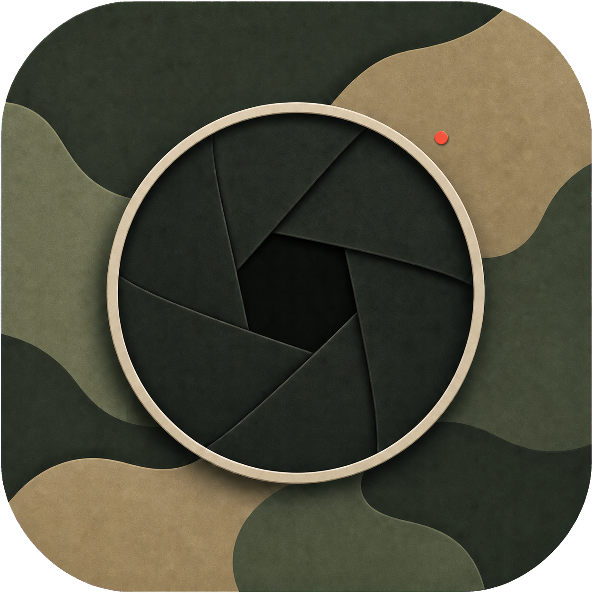
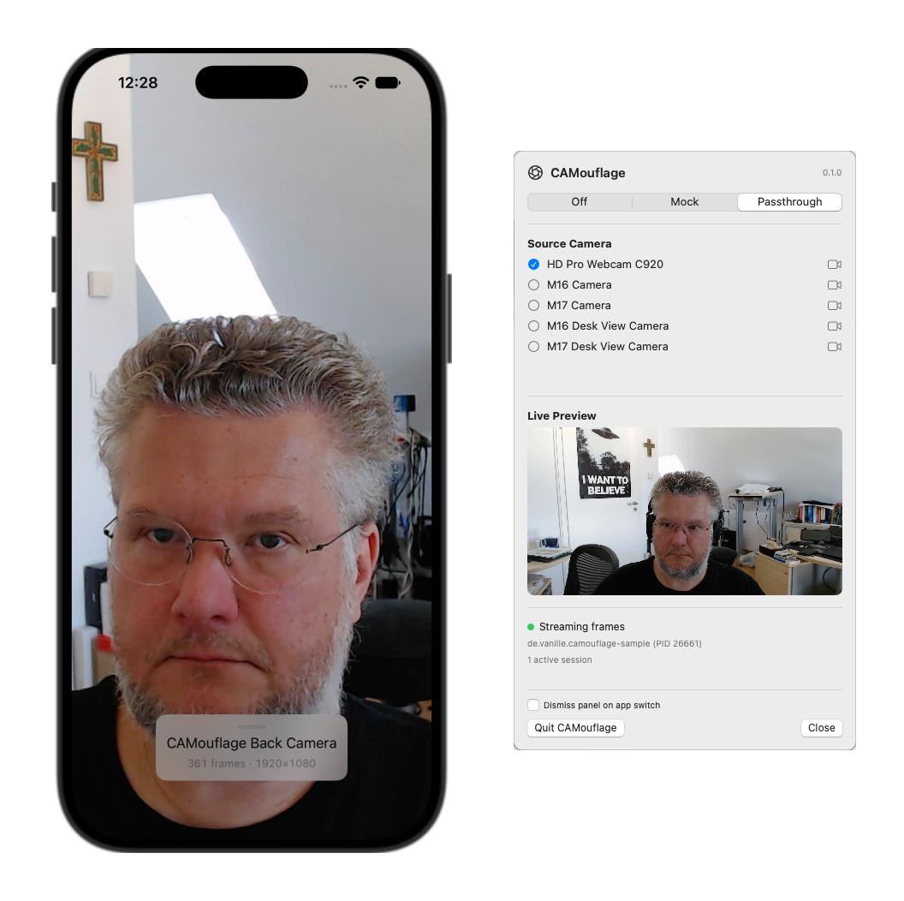
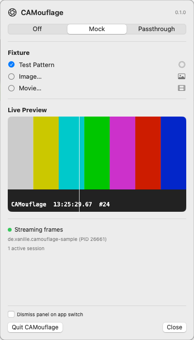

<p align="center">
  
</p>

<h1 align="center">CAMouflage</h1>

<p align="center"><strong>Use a camera from the iOS Simulator.</strong></p>

The iOS Simulator has no camera: `AVCaptureDevice` discovery returns nothing,
sessions never produce frames, and every scan/photo/video flow is untestable
without a real device. CAMouflage disguises a fake capture pipeline as the real
one — transparently bridging AVFoundation capture from a simulated app to
configurable mock fixtures or actual camera hardware on the host Mac.

Sibling project to [ImpossiBLE](https://github.com/mickeyl/ImpossiBLE). Same
philosophy, same integration story: add a local Swift package, build, run. No
`DYLD_INSERT_LIBRARIES`, no system extension, no code changes in the app under
test. The one intentional divergence is where the passthrough logic lives — see
the [architecture note](#architecture-note) under How It Works.

> **Status: 0.4.0 Preview.** Mock **and passthrough** modes work — a menu bar
> app serves either a fixture (test pattern, static image, or looping movie) or a
> live feed from a real Mac camera (built-in, external UVC, or Continuity Camera)
> as the simulator's front and back cameras, rendered through stock
> `AVCaptureVideoPreviewLayer` and delivered to `AVCaptureVideoDataOutput`
> delegates, with working **photo capture** (`AVCapturePhotoOutput`) and
> **QR/barcode scanning** (`AVCaptureMetadataOutput`, in-process via Vision).
> Tests can also upload ephemeral per-device image or generated machine-code
> fixtures without changing the user's menu-bar selection.
> See [PLAN.md](PLAN.md) for the full roadmap.

<p align="center">
  
</p>

<p align="center">
  <em>Passthrough: the Mac's HD Pro Webcam served as the simulator's back camera,
  live at 1920×1080 through a stock <code>AVCaptureVideoPreviewLayer</code>. The
  menu bar panel selects the source camera and mirrors what the simulator sees in
  a live preview; the on-device overlay is draggable.</em>
</p>

<p align="center">
  
  <br>
  <em>Mock: the SMPTE test-pattern fixture, with a live preview of exactly what the simulator receives.</em>
</p>

## How It Works

CAMouflage is a two-process architecture:

1. **Library** (linked into your iOS app) — Uses Objective-C runtime swizzling
   to intercept AVFoundation capture calls at load time. Device discovery,
   session lifecycle, and control messages travel as JSON over a Unix domain
   socket (`/tmp/camouflage.sock`); video frames arrive on a separate binary
   frame socket (`/tmp/camouflage-frames.sock`) as length-prefixed JPEG.

2. **Mac menu bar app** (runs natively on macOS) — Owns both sockets and
   serves virtual camera devices. In **Mock** mode the source is a configurable
   fixture: SMPTE-style test pattern with timestamp burn-in, a static image, or a
   looping movie file. In **Passthrough** mode the source is a real camera
   attached to the Mac (built-in FaceTime HD, an external UVC webcam, Continuity
   Camera, or Desk View), selected from the panel; the same app forwards its
   frames over the same sockets, so the simulator side never knows the
   difference. The real camera is powered on only while a simulator app is
   actually streaming.

Your app code remains unchanged — `AVCaptureDevice`, `AVCaptureSession`,
`AVCaptureVideoPreviewLayer`, and `AVCaptureVideoDataOutput` work as expected.
On device builds, all CAMouflage code compiles to no-ops.

### Architecture note

This is where CAMouflage deliberately diverges from ImpossiBLE. ImpossiBLE keeps
its role logic — the CoreBluetooth work, including passthrough to real hardware —
in a separate helper **daemon** that the menu bar app only supervises (start,
stop, mutual exclusion). CAMouflage folds passthrough **into the menu bar app**
instead: the real-camera capture and the mock frame server run in the same
process.

It gets away with this because the frame plane is source-agnostic — the simulator
library only ever reads JPEG frames off the socket, so a real Mac camera and a
mock fixture are byte-identical on the wire. Passthrough therefore needs no second
process, no extra sockets, and no protocol change; one app owns both modes and the
switch between them is mutually exclusive by construction. A dedicated helper
daemon would only earn its keep if mock and passthrough ever had to run at the same
time (or if the capture stack needed crash isolation from the UI). Until then, one
process is the simpler, honest shape. The socket protocol is the seam, so a daemon
can be re-extracted later without touching the library or the wire format.

## Quick Start

```bash
# Build and start the Mac menu bar app, then select "Mock" in its panel
make mac-run

# In Xcode: add CAMouflage as a local Swift package dependency,
# then build and run your app in the iOS Simulator.
```

Or try the bundled sample (the `.xcodeproj` is generated, not committed):

```bash
cd SampleApp && xcodegen generate && open SampleApp.xcodeproj
# Run it in any iPhone simulator — you should see the fixture as the camera
# feed, with a live frame counter at the bottom.
```

For headless setups the Mac app's state can be seeded before launch instead
of clicking the panel (mode, server flag, and fixture live in its defaults
domain):

```bash
defaults write de.vanille.camouflage-mac ProviderMode mock
defaults write de.vanille.camouflage-mac ServerEnabled -bool true
```

`make` without arguments lists all targets. Development loop: `make
mac-relaunch` rebuilds a debug bundle and restarts the running app; `make
log` tails its output; `make status` / `make mac-stop` manage the process.

### Test-owned fixtures

UI and integration tests can own their camera input instead of depending on the
menu-bar selection. The configuration is visible in the provider panel, is never
persisted, survives a provider restart within the same test process, and is
cleared when that process disconnects:

```swift
import CAMouflage

let configuration = try JSONSerialization.data(withJSONObject: [
    "name": "QR login",
    "devices": [[
        "id": "login-camera",
        "name": "Login QR",
        "position": "back",
        "source": [
            "kind": "machineCode",
            "symbology": "qr",
            "payload": "https://example.test/login",
        ],
    ]],
])

precondition(CAMouflageSetMockConfiguration(configuration), "CAMouflage provider unavailable")
defer { CAMouflageClearMockConfiguration() }
```

The bundled `SampleAppTests` target demonstrates the complete headless path:
upload a QR fixture, discover its virtual camera, start `AVCaptureSession`, and
assert the `AVCaptureMetadataOutput` callback.

## Requirements

- macOS 15+
- Xcode 16+ (Swift Package Manager)
- `xcodegen` (optional, for the sample app)

## Repository Map

| Path | Contents |
|---|---|
| `Sources/CAMouflage` | Simulator-side library (Objective-C, `CMF` prefix) |
| `Sources/CAMouflage-Mac` | `CAMouflage-Mac.app` menu bar provider (SwiftPM) |
| `SampleApp` | xcodegen demo and client-owned QR fixture XCTest |
| `PLAN.md` | Full roadmap and per-phase status |
| `AGENTS.md` | Architecture invariants, wire protocol, validation recipe |

## Current limitations

- Preview, sample buffers, photo capture, and QR/barcode scanning work; movie
  recording (`AVCaptureMovieFileOutput`) does not yet.
- A captured photo is the current preview/camera frame re-encoded, not a separate
  full-resolution still.
- Passthrough forwards the camera's native format re-encoded as JPEG; it does
  not yet honor a requested resolution/fps, mirror front cameras, or map
  built-in/Continuity devices to specific front/back positions.
- The menu-bar selection feeds both stock virtual cameras; client-supplied test
  configurations can provide distinct per-device sources.
- One simulator client at a time; the most recently connected app takes over.

## License

MIT — see [LICENSE](LICENSE) for details.
